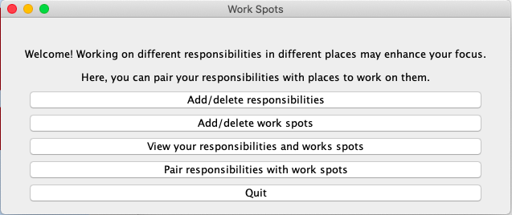
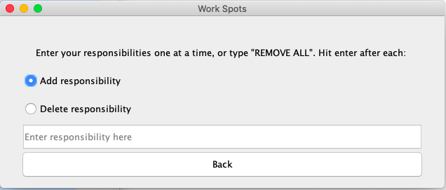
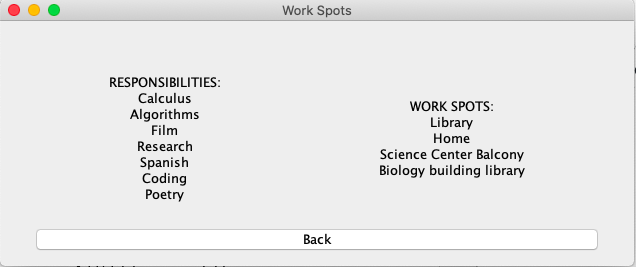
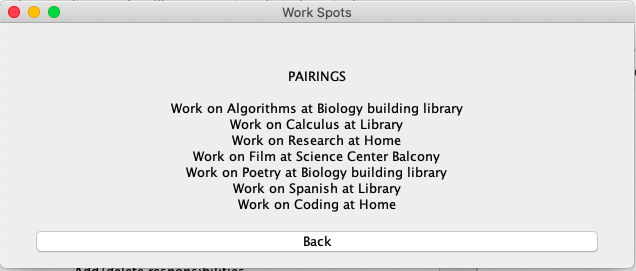

# Work Spots
For many people, working in a consistent space for consistent tasks helps focus their work (e.g. exclusively working on writing in a home office, but working on finances in a local cafe). However, it may also be beneficial to periodically change locations to refresh one's headspace. Based on this notion, this program pseudo-randomly pairs responsibilities with locations, and the pairings reshuffle periodically. Personal responsibilities and locations must be entered manually, but they will be stored locally for reuse the next time the program is run.

## Download
Jar (requires JVM installed): [workspots.jar](workspots.jar)

## Version History
### Version 2 - Current
This version is a GUI using Java Swing. It was already partially written in Java, so as a practice in event-listeners and action-based programs, I turned the program into a GUI in the language it was written in. For similar projects in the future, I would use newer resources geared towards user-interaction like ReactJS rather than Swing.

The options menu is the same as in Version 1, except the responsibilities/work spots can be deleted. Keyphrase "REMOVE ALL" can be entered to remove all data. Data is still stored in txt files, but they are saved to the user's Documents directory in a subdirectory named WorkSpotsData. Pairings shuffle every two weeks, and on the first day of a new shuffle, the Pairings window lets you know that the pairings have changed.

### Version 1
This version is a command-line based program. The option menu is as shown:
>1) Add responsibilities
>2) Add work spots
>3) View your responsibilities and work spots
>4) Pair responsibilities and work spots
>5) Quit

The pairings reshuffle every two weeks. Responsibilities and work spots are stored locally in txt files titled "responsibilities.txt" and "workspots.txt", respectively. 
